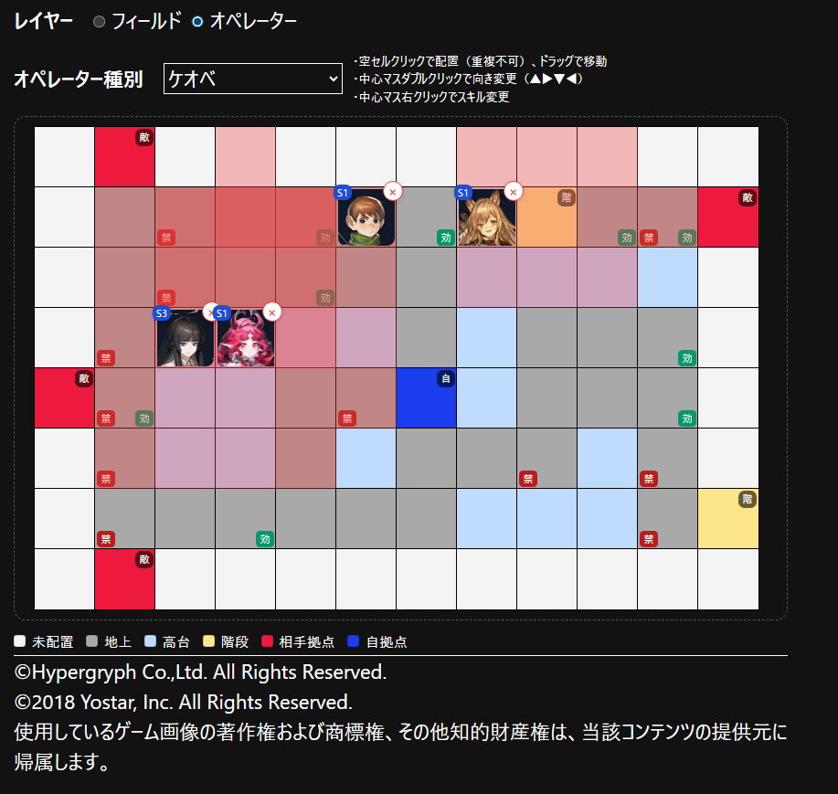

# アークナイツ指揮練習ツール

アークナイツの指揮練習を行うためのツールです。

## アプリについて

アークナイツのオペレーターの配置を検討するためのツールです。

**主な機能**
- フィールドの作成
  - 通常マス/高台マス/自拠点マス/敵拠点マス/階段マスを配置
  - 通常マス/高台マスに配置不可/効果ありのタグ付け
  - フィールドのサイズ変更（最大12×12）
  - 選択範囲のコピー&ペースト
- オペレーターの配置
  - オペレーターをダブルクリックで向き変更
  - ドラッグでオペレーターの移動
  - オペレーターを右クリックでスキル切替

## ローカル起動

```sh
npm run dev

# or start the server and open the app in a new browser tab
npm run dev -- --open
```

## ビルド

```sh
npm run build
```

## 使用例
危機契約＃3「浄罪」― 通常試験区画



## Content Credits
©Hypergryph Co.,Ltd. All Rights Reserved.
©2018 Yostar, Inc. All Rights Reserved.
使用しているゲーム画像の著作権および商標権、その他知的財産権は、当該コンテンツの提供元に帰属します。
